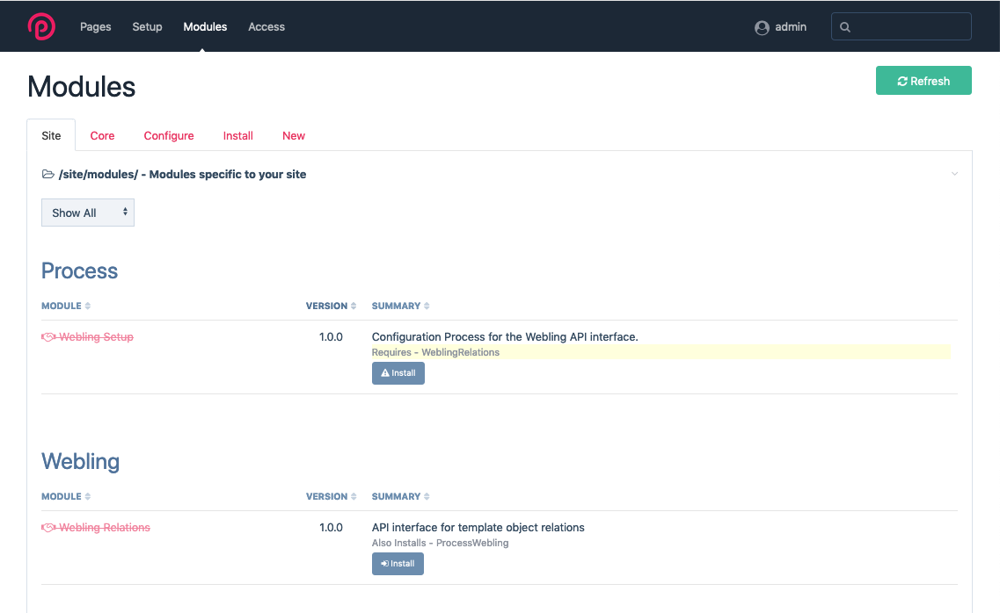
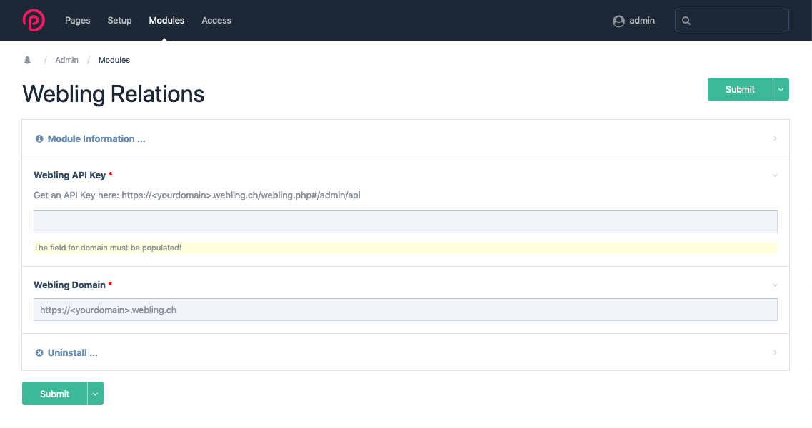
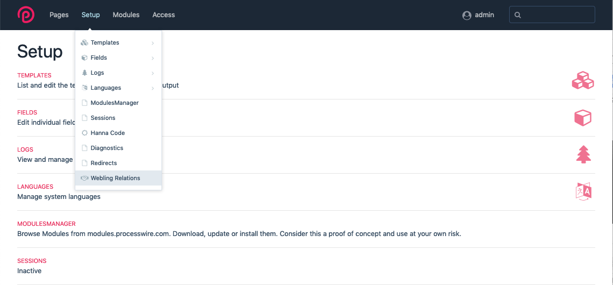
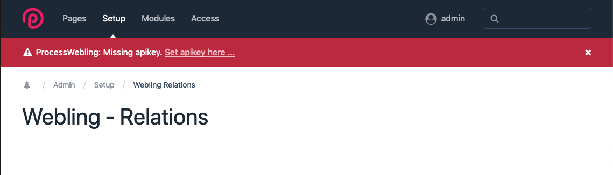
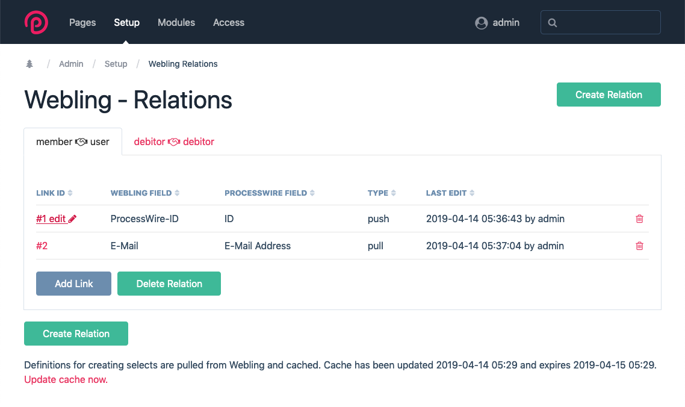
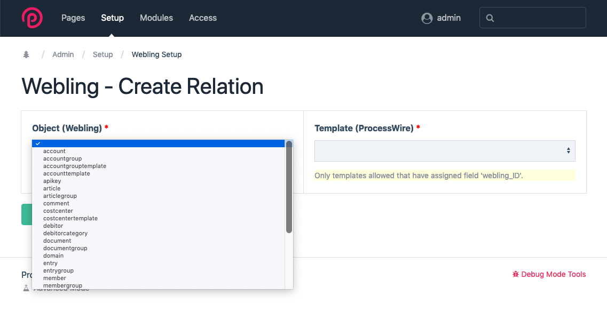
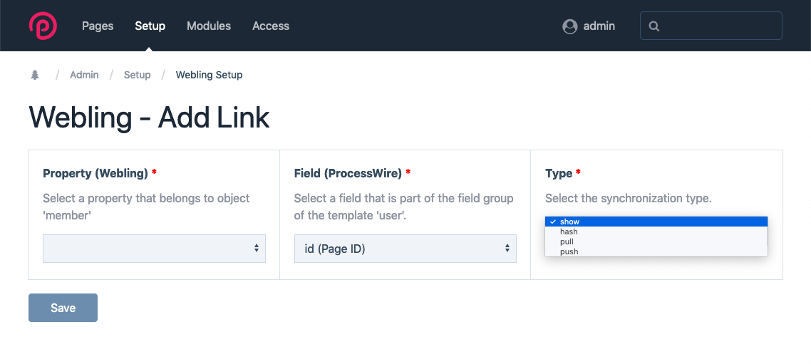

Modul Webling Relations
========================

Konfigurierbare Schnittstelle zwischen der Mitgliederverwaltungssoftware Webling und dem CMS/ CMF ProcessWire auf Basis der Webling API.

Wenn Sie eine Lizenz für dieses Modul erwerben möchten, wenden Sie sich bitte an [qualyweb.com](https://qualyweb.com/de/kontakt/)

## Installation

Bei der Installation des Moduls muß die entsprechende Webling **Subdomain** und ein **API Key** mit entsprechenden Berechtigungen eingerichtet werden.

## Konfiguration

### Relation

**Relation** beschreibt eine Beziehung zwischen einem Webling **Objekttyp** und einem ProcessWire **Template**. z.B. Objektyp 'member' und Template 'user'.

#### Bedingungen
+ Pro **Objekttyp**, bzw. **Template** kann jeweils **nur eine Relation** erstellt werden.
+ Es können nur Templates verwendet werden denen das ProcessWire Feld **webling_ID** zugeordnet wurde. Das Feld wird bei der Installation durch das Modul automatisch erzeugt. Es ist zunächst nur für Nutzer mit der Rolle _**superuser**_ sicht- und editierbar. In den Feldeinstellungen können weitere Rollen zugewiesen werden. 

### Link

**Link** beschreibt eine Beziehung innerhalb einer Relation zwischen einem Webling **Property** (Datenfeld) und einem ProcessWire **Feld**. Für die Art der Beziehung gibt es **4 Typen**:

+ **show**  
Der Inhalt wird aus Webling eingelesen und in der aktuellen ProcessWire Session gespeichert. Das entsprechende ProcessWire Feld bleibt leer oder wird beim nächsten Speichern geleert. Eine Aktualisierung aus Webling erfolgt nach dem Start einer neuer ProcessWire Session, oder, wenn ein Wert in einem Feld vom Typ pull oder push verändert wurde und die Seite gespeichert wurde.

+ **hash**  
Der Inhalt wird aus Webling eingelesen und in der aktuellen ProcessWire Session gespeichert. Das entsprechende ProcessWire Feld wird mit einem Hashwert des Originalwertes befüllt. Dies ermöglicht den Webling Wert mit dem ProcessWire Wert zu vergleichen. Bei Inkosistenz wird ein entsprechender Hinweis ausgegeben. Eine Aktualisierung erfolgt wie beim Typ _**show**_. Der tatsächliche Wert wird nicht in der ProcessWire Datenbank gespeichert. Es ist nicht möglich aus den Daten in der ProcessWire Datenbank den tatsächlichen Wert zu ermitteln.

+ **pull**  
Inhalte werden bei jedem Speichern synchronisiert. Die Webling Datenbank ist führend. Beim Öffnen der ProcessWire Page-Edit Seite erscheint der Webling Wert. Es werden keine Hinweise bei Änderung ausgegeben. Die ProcessWire Datenbank wird stillschweigend aktualisiert.

+ **sync**  
Inhalte werden bei jedem Speichern synchronisiert. Die Webling Datenbank ist führend. Beim Öffnen der ProcessWire Page-Edit Seite erscheint der Webling Wert. Im Falle von Inkosistenz wird ein Hinweis ausgegeben, dass der Wert aktualisiert wurde.

+ **push**  
Inhalte werden bei jedem Speichern synchronisiert. Die ProcessWire Datenbank ist führend. Beim Öffnen der ProcessWire Page-Edit Seite wird der ProcessWire Wert geladen.
Im Falle von Inkosistenz wird eine Warnung ausgegeben.

Zusätzlich besteht die Möglichkeit die ProcessWire Page ID mit einem Webling Datenfeld zu verknüpfen. Hier ist nur der Typ **push** zu gelassen. Der Wert ist auf der ProcessWire Seite unveränderbar. Eine Aktualisierung des Wertes auf der Webling Seite findet jeweils nur dann statt, wenn von der ProcessWire Seite ein anderer **push** Wert erfolgreich aktualisiert wird.

#### Bedingungen
+ Pro **Property** bzw. **Feld** kann jeweils **nur ein Link** erstellt werden.
+ ProcessWire Felder müssen **access_control** aktiviert haben. Ohne diese Einstellung werden Daten zwar eingelesen und synchronisiert, es werden jedoch keine Zusatzinformationen oder Warnungen ausgegeben.
+ Ist **access_control** aktiviert sind die Linktypen _**show**_, _**hash**_ und _**pull**_ nicht editierbar.	
+ Bei der Einrichtung muß auf Kompatibilität der Datentypen geachtet werden.
+ Der Linktyp _**hash**_ kann nicht immer gewählt werden, da das Format des Hashwertes für verschiedene ProcessWire Felder (z. B: *email*) nicht zulässig ist. In diesem Fall entspricht das Verhalten dem Typ _**show**_

## Funktionsweise

Die Schnittstelle synchronisiert im Hintergrund Daten zwischen ProcessWire und Webling.
Die Synchronisation wird jeweils durch das Laden des Editierbereichs oder das Speichern einer ProcessWire Seite ausgelöst. Zur Identifizierung muß auf der ProcessWire Seite die eindeutige **Webling-Objekt-ID** im Feld **webling_ID** vorhanden sein.

### Entsprechungen

| Webling | ProcessWire | Identifikatoren |
|:--|:--|:--|
| Objekttyp | Template | name &xharr; id |
| Datenfeld/ Property | Feld | id &xharr; id |
| Objekt| Page | Objekt ID &xharr; Feldwert: *webling_ID* |

<small>_Version: 1.0.1 Datum: 2019-04-24_

## Screenshots

