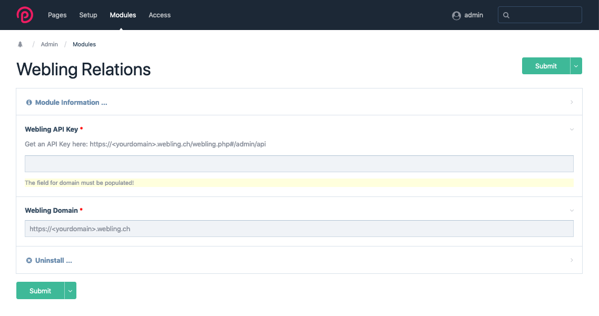
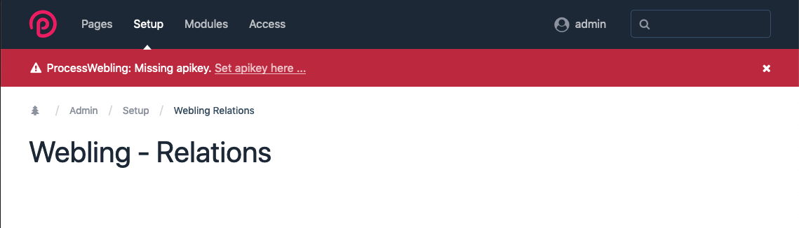

Module Webling Relations
=========================

Configurable interface between the members administration software Webling and the CMS/ CMF ProcessWire based on the Webling API.

If you would like to purchase a license for this module, please contact [qualyweb.com](https://qualyweb.com/en/contact/)

## Installation

When installing the module, the corresponding Webling **subdomain** and an **API key** must be set up with appropriate authorizations.

## Configuration

### Relation
**Relation** describes a relationship between a Web ling object type and a ProcessWire **template**. e.g. Object type 'member' and template 'user'.

#### Conditions
+ Only one relation can be created for each **object type** or **template**.
+ Only templates with the ProcessWire field **webling_ID** assigned can be used. The field is automatically generated by the module during installation. It is initially visible and editable only for users with the _**superuser role**_. In the field settings, additional roles can be assigned.

## Link
**Link** describes a relationship within a relation between a Webling **property** (datafield) and a ProcessWire **Field**. There are **4 types** of relationships:

+ **show**
	The content is imported from Webling and saved in the current ProcessWire session. The corresponding ProcessWire field remains empty or will be emptied the next time it is saved. An update from Webbing occurs after the start of a new ProcessWire session, or when a value in a pull or push field has been changed and the page has been saved.
	
+ **hash**
	The content is imported from Webling and saved in the current ProcessWire session. The corresponding ProcessWire field is filled with a hash value of the original value. This allows the Webling value to be compared with the ProcessWire value. In case of inconsistency, a corresponding note is issued. An update takes place like the type _**show**_. The actual value is not stored in the ProcessWire database. It is not possible to determine the actual value from the data in the ProcessWire database.
	
+ **pull**
	Content is synchronized each time you save it. The Webling database is a leader. When opening the ProcessWire Page-Edit page, the Webling value appears. In the case of inconsistency, an indication is issued that the value has been updated.
	
+ **push**
	Content is synchronized each time you save it. The ProcessWire database is a leader. When opening the ProcessWire Page-Edit page, the ProcessWire value is loaded. In the case of inconsistency, a warning is issued.
	
In addition, it is possible to link the ProcessWire Page ID with a Webling data field. Here only the type **push** is allowed. The value can not be changed on the ProcessWire side. An update of the value on the Web page takes place only if a different **push** value is successfully updated by the ProcessWire page.

#### Conditions
+ **Only one link** can be created per **property** or **field**.
+ ProcessWire fields must have **access_control** activated. Without this setting, data is read and synchronized, but no additional information or warnings are output.
+ When setting up, ensure that the data types are compatible.
+ The link type **hash** can not always be selected because the format of the hash value is not allowed for some ProcessWire fields (eg: *email*). In this case, the behavior is the same as when type show is selected.

## Functionality

The interface synchronizes data between ProcessWire and Webling in the background. Synchronization is triggered by loading the page editing area or saving a ProcessWire page. For identification, the unique **Webling object ID** must exist in the field **webling_ID** on the ProcessWire page.

### Correspondences

| Webling | ProcessWire | Identifiers |
|:--|:--|:--|
| Objecttype | Template | name &xharr; id |
| Property | Field | id &xharr; id |
| Object | Page | object id &xharr; field value: *webling_ID* |

<small>_Version: 1.0.0 Date: 2019-04-13_

## Screenshots

